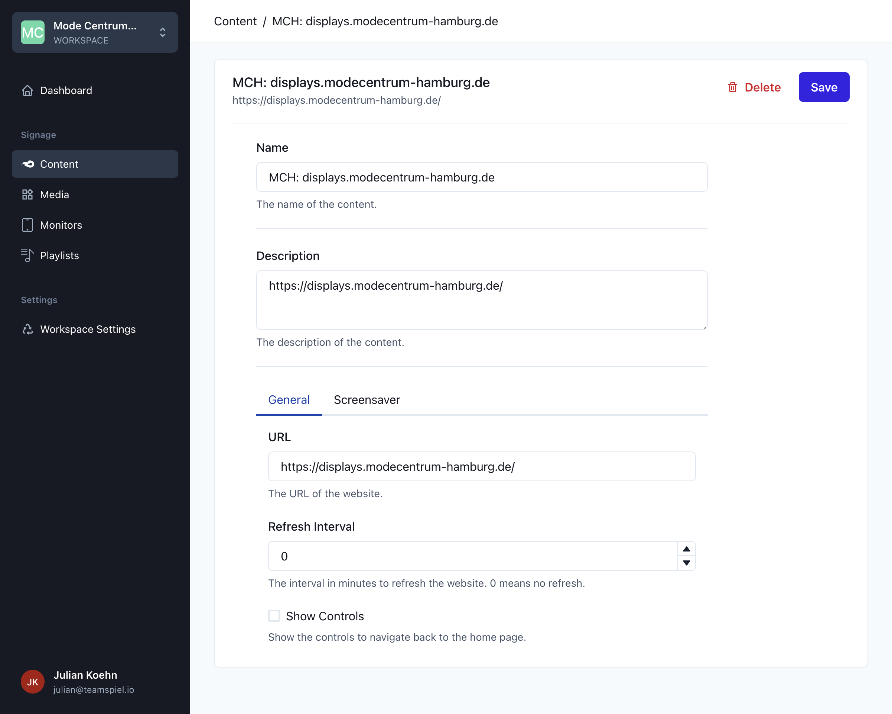

import Image from 'next/image'

# Einführung in den Content Type "Website"

Der Content Type "Website" ermöglicht es, eine URL als Inhalt in einer Wiedergabeliste anzuzeigen. Dazu können Sie die URL definieren, die angezeigt werden soll, sowie das "Refresh Interval" einstellen, damit die Website im angegebenen Interval (in Sekunden) aktualisiert wird. Dies ist nützlich, wenn es sich um Websites handelt, die immer neue Inhalte anzeigen, aber nicht selbst aktualisiert werden können.

Eine weitere Option, die beim Content Type "Website" verfügbar ist, ist die "Controls" Option. Dies ermöglicht es, einen "Home" Button anzuzeigen, um zurück zum Anfang der Website zu gelangen, was praktisch ist, wenn man tief in der Website navigieren kann.

Es ist zu beachten, dass einige Websites ihre Inhalte mithilfe von Iframes bereitstellen. Iframes kommen oft mit Sicherheitseinstellungen wie CSP oder same-site, aber unser Player umgeht diese Einstellungen und ermöglicht das Einbetten dieser Websites.

Mit diesem Content Type können Sie Websites in eine Wiedergabeliste einbinden und die Anzeige der Website an Ihre Anforderungen anpassen, um eine ansprechendere Mediendarstellung zu erreichen.