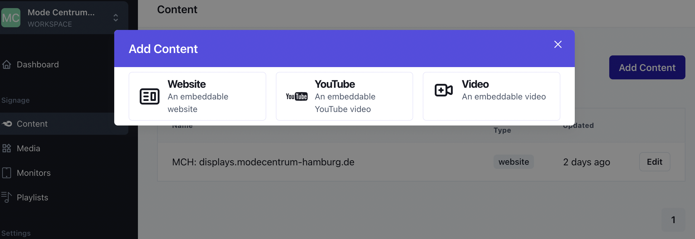

# Erstellen des ersten Contents

Bevor Sie mit der Erstellung einer Wiedergabeliste beginnen können, müssen Sie zunächst Content erstellen.
In diesem Abschnitt werden wir die Schritte besprechen, die erforderlich sind, um Ihren ersten Content zu erstellen.

## 1. Öffnen Sie das Fenster für das Erstellen von Content:

Wählen Sie im linken Navigationsmenü den Punkt "Content" aus und klicken Sie anschließend auf "Add Content",
um ein Fenster zum Erstellen von Content zu öffnen.

## 2. Wählen Sie den Content Type:

Bevor Sie mit dem Erstellen von Content beginnen, müssen Sie zunächst den Content Type auswählen, den Sie verwenden möchten. Zum Beispiel "Website", "Video" oder "YouTube".

## 3. Wählen Sie den Content Type:

Im geöffneten Fenster können Sie den Content Type auswählen, den Sie erstellen möchten.

## 4. Geben Sie die erforderlichen Informationen ein:

Je nach Content Type müssen Sie unterschiedliche Informationen eingeben.
Für den Content Type "Website" benötigen Sie beispielsweise die URL der Website, das Refresh Interval
und die Optionen für die Steuerung.

## 5. Konfigurieren Sie die Optionen:

Je nach Content Type können Sie verschiedene Optionen konfigurieren. Schauen Sie sich die Optionen für den Content [Type "Website" an](/content-types/website).